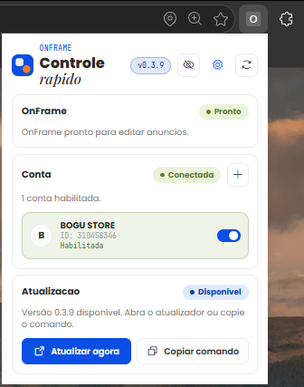
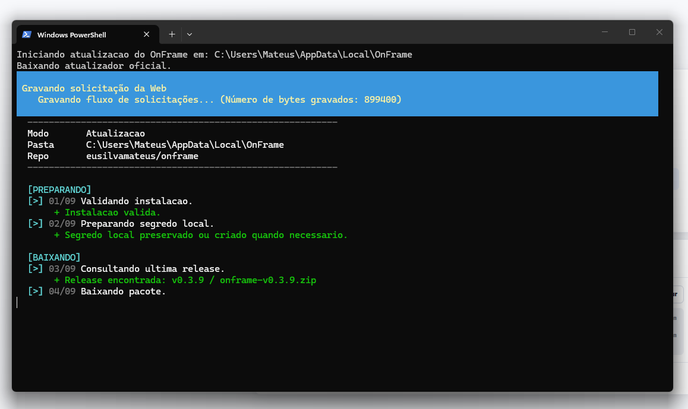
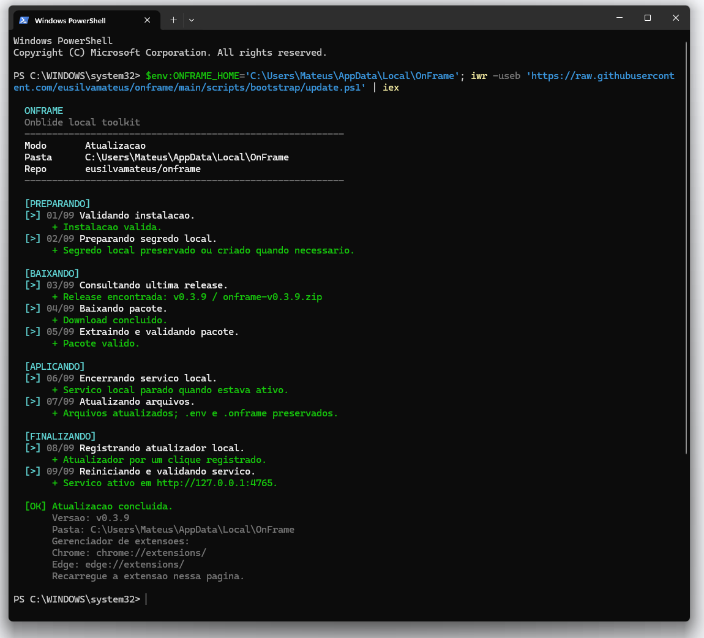

# Atualizar o OnFrame

O OnFrame pode avisar quando existe uma nova versao disponivel. Nas versoes
recentes, o popup da extensao passou a abrir uma pagina local de atualizacao,
que tenta iniciar o atualizador automaticamente.

## Atualizacao por um clique

Quando houver uma nova versao:

1. Abra o popup do OnFrame clicando no icone da extensao.
2. Clique em `Atualizar agora`.
3. O navegador abre a pagina local de atualizacao.
4. Autorize a abertura do atualizador, se o navegador perguntar.

Depois da autorizacao, uma janela do PowerShell no Windows ou do Terminal no
macOS abre e executa os comandos da atualizacao.

O exemplo abaixo mostra o fluxo no Windows. No Mac, as mesmas etapas aparecem
no Terminal.

5. Aguarde a janela concluir o processo.
6. Recarregue a extensao no Chrome ou Edge.

## Se o navegador nao abrir o atualizador

A pagina tambem mostra um comando manual. Nesse caso:

1. Clique em `Copiar comando manual`.
2. Abra o PowerShell no Windows ou o Terminal no macOS.
3. Cole o comando copiado e pressione Enter.
4. Aguarde a atualizacao terminar.

## Depois de atualizar

Abra o gerenciador de extensoes do navegador:

- `chrome://extensions/`
- `edge://extensions/`

Encontre o OnFrame e clique em `Recarregar`.

Depois disso, volte para a pagina do anuncio e atualize a pagina do Mercado
Livre.

## Quando usar o comando manual

Use o comando manual quando:

- o navegador bloquear a abertura do atualizador;
- a pagina local nao conseguir abrir o PowerShell ou o Terminal;
- a instalacao ainda nao tiver registrado o atualizador por um clique;
- voce preferir acompanhar tudo direto pelo terminal.

O resultado final e o mesmo: o OnFrame baixa a ultima versao publicada e atualiza
a instalacao local.
