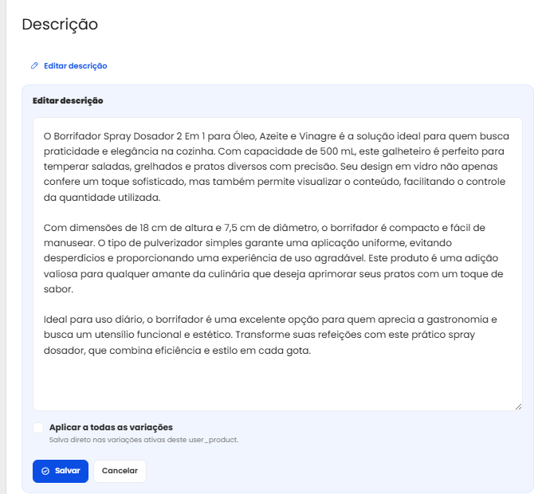
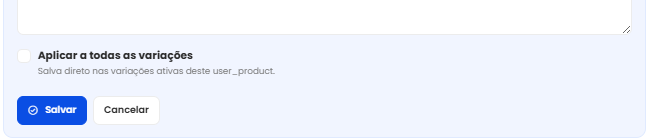

# Editar descricao no anuncio

A edicao de descricao permite alterar o texto do anuncio diretamente na pagina
do Mercado Livre. Voce nao precisa abrir outra tela para revisar o conteudo:
edita, salva e confere tudo no mesmo lugar.

## Quando usar

Use este recurso quando quiser corrigir texto, melhorar explicacoes, ajustar
informacoes do produto ou padronizar descricoes entre variacoes.

Ele e util para mudancas pequenas e rapidas, mas tambem funciona para textos
maiores.

## Como editar

1. Abra a pagina do anuncio no Mercado Livre.
2. Va ate a secao `Descricao`.
3. Se aparecer `Ver descricao completa`, clique primeiro para expandir o texto.
4. Clique em `Editar descricao`.
5. Altere o texto no campo que aparece no proprio corpo do anuncio.
6. Clique em `Salvar`.

Se quiser desistir da alteracao, clique em `Cancelar`.

## Aplicar em todas as variacoes

Quando o anuncio possui variacoes independentes, o OnFrame pode mostrar a opcao
`Aplicar a todas as variacoes`.

Ao marcar essa opcao, a descricao sera enviada para as variacoes ativas que
puderem receber a alteracao.

Se alguma variacao nao puder ser alterada, o OnFrame mostra o resultado depois
do envio. Assim voce sabe exatamente o que foi salvo e o que ficou pendente.

## O que observar antes de salvar

Antes de confirmar, confira se o texto:

- nao promete algo que muda de uma variacao para outra;
- nao menciona uma cor, tamanho ou modelo que nao vale para todas as variacoes;
- esta completo o suficiente para o comprador entender o produto;
- nao repete informacoes de forma desnecessaria.

## Depois de salvar

O Mercado Livre pode demorar alguns instantes para atualizar a descricao na
pagina. Se voce salvar e ainda vir o texto antigo, recarregue o anuncio.
