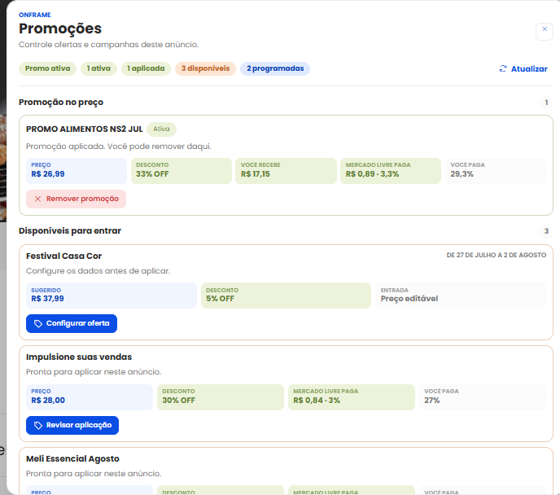
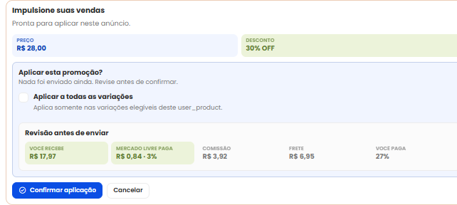
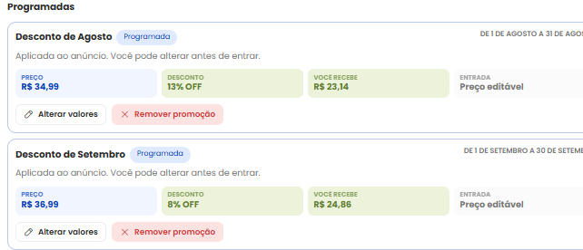

# Promocoes e acoes em massa

O OnFrame mostra promocoes, descontos, custos e oportunidades direto na pagina
do anuncio. A ideia e facilitar a revisao antes de aplicar, alterar ou remover
uma promocao.

## O que voce consegue fazer

Quando o Mercado Livre disponibiliza a acao para o anuncio, o OnFrame permite:

- aplicar uma promocao;
- configurar preco promocional;
- alterar valores antes da promocao entrar;
- remover uma promocao;
- revisar quanto voce recebe;
- revisar descontos, comissao, frete e reducao de tarifa do Mercado Livre;
- aplicar a mesma acao em variacoes elegiveis.

## Entendendo os blocos de informacao

Os cards mostram apenas as informacoes mais importantes para decidir com
seguranca.

Voce pode encontrar:

- `Preco`: valor atual ou valor final da promocao.
- `Desconto`: percentual aplicado.
- `Voce recebe`: estimativa do valor que fica para o vendedor.
- `Reducao de tarifa do Mercado Livre`: beneficio concedido pelo Mercado Livre na promocao.
- `Desconto do vendedor`: parcela do desconto comercial assumida pelo vendedor.
- `Reducao de tarifa por venda`: desconto confirmado pelo Mercado Livre nos custos por venda.
- `Comissao`: custo da venda.
- `Frete`: custo relacionado ao envio.

`Reducao de tarifa por venda` so aparece quando a API informa `boosted_offer`.
Cupons e descontos por pagamento continuam condicionais ao comprador ou a forma
de pagamento e nao entram na estimativa principal.

Nem toda promocao tem todos os campos. Quando uma informacao nao existe para
aquele caso, o OnFrame evita preencher a tela com blocos vazios.

## Aplicar promocao

1. Abra o popover ou modal de promocoes.
2. Escolha a promocao disponivel.
3. Preencha os campos solicitados, como preco promocional ou estoque reservado,
   quando aparecerem.
4. Revise os valores.
5. Clique em `Confirmar aplicacao`.

Enquanto o envio esta em andamento, o OnFrame mostra estado de carregamento para
evitar duvida sobre o que esta acontecendo.

## Alterar ou remover promocao

Promocoes ja aplicadas podem mostrar acoes como `Alterar valores` ou `Remover
promocao`, dependendo do tipo de campanha e das regras do Mercado Livre.

Antes de confirmar, leia a revisao exibida pelo OnFrame. Ela mostra o efeito da
acao no anuncio.

## Aplicar em todas as variacoes

Em anuncios com variacoes independentes, uma promocao aplicada em uma variacao
nao necessariamente muda as demais.

Quando fizer sentido, o OnFrame mostra `Aplicar a todas as variacoes`. Ao marcar
essa opcao, a extensao verifica quais variacoes podem receber a acao e mostra um
resumo antes ou depois do envio.

Algumas variacoes podem nao ser elegiveis para a mesma promocao. Outras podem
ter limites de preco diferentes. Por isso a revisao e importante: ela evita que
voce presuma que todas as variacoes aceitaram exatamente a mesma mudanca.

## Boas praticas

Antes de confirmar uma promocao, confira:

- se o preco final esta correto;
- se o desconto faz sentido para a margem;
- se o valor `Voce recebe` esta dentro do esperado;
- se todas as variacoes desejadas foram incluidas;
- se alguma variacao ficou de fora por regra do Mercado Livre.
