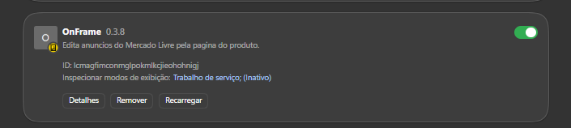

# Instalacao e atualizacao

## Objetivo

Este guia instala o OnFrame, carrega a extensao no navegador e explica os
comandos locais de manutencao no Windows e macOS.

## Pre-requisitos

- Windows com Node.js 20 ou superior; ou
- macOS 13 Ventura ou superior. O instalador baixa um runtime Node.js privado
  para o OnFrame, sem exigir Homebrew ou `sudo`.
- Chrome ou Edge com o modo desenvolvedor ativado.
- Uma conta Mercado Livre que possa ser conectada ao OnFrame.

## Instalacao

No Windows, abra o PowerShell e execute:

```powershell
iwr -useb 'https://raw.githubusercontent.com/eusilvamateus/onframe/main/scripts/bootstrap/install.ps1' | iex
```

No macOS, abra o Terminal e execute:

```sh
onframe_bootstrap="$(mktemp)" && \
/usr/bin/curl -fsSL 'https://raw.githubusercontent.com/eusilvamateus/onframe/main/scripts/bootstrap/install.sh' -o "$onframe_bootstrap" && \
/bin/sh "$onframe_bootstrap"; onframe_status=$?; rm -f "$onframe_bootstrap"; (exit "$onframe_status")
```

A instalacao padrao fica em `%LOCALAPPDATA%\OnFrame` no Windows e em
`~/Library/Application Support/OnFrame` no macOS.

## Carregar a extensao

1. Abra `chrome://extensions` ou `edge://extensions`.
2. Ative o modo de desenvolvedor.
3. Clique em `Carregar sem compactacao`.
4. Selecione a pasta `extension` da instalacao:

```text
Windows: %LOCALAPPDATA%\OnFrame\extension
macOS: ~/Library/Application Support/OnFrame/extension
```

## Conectar uma conta

1. Abra a pagina de um anuncio no Mercado Livre.
2. Clique no icone da extensao ou no controle do OnFrame na pagina.
3. Clique em `Conectar`.
4. Autorize a conta Mercado Livre.
5. Volte para a pagina do anuncio.

## Atualizar

Quando houver uma versao nova, use `Atualizar agora` no popup ou nas opcoes da
extensao. A tela interna da extensao chama o protocolo local
`onframe-updater://update`; o navegador pode pedir autorizacao para abrir o
atualizador. Acompanhe a conclusao no PowerShell ou no Terminal e, ao final,
recarregue o OnFrame em `chrome://extensions` ou `edge://extensions`.




Para atualizar manualmente no Windows:

```powershell
iwr -useb 'https://raw.githubusercontent.com/eusilvamateus/onframe/main/scripts/bootstrap/update.ps1' | iex
```

No macOS:

```sh
onframe_bootstrap="$(mktemp)" && \
/usr/bin/curl -fsSL 'https://raw.githubusercontent.com/eusilvamateus/onframe/main/scripts/bootstrap/update.sh' -o "$onframe_bootstrap" && \
ONFRAME_HOME="$HOME/Library/Application Support/OnFrame" /bin/sh "$onframe_bootstrap"; onframe_status=$?; rm -f "$onframe_bootstrap"; (exit "$onframe_status")
```

## Iniciar, verificar e parar

Use estes comandos quando o popup indicar que o servico local esta fechado ou
quando precisar diagnosticar a instalacao.

### Iniciar

```powershell
iwr -useb 'https://raw.githubusercontent.com/eusilvamateus/onframe/main/scripts/bootstrap/start.ps1' | iex
```

```sh
"$HOME/Library/Application Support/OnFrame/scripts/bootstrap/start.sh"
```

### Verificar

```powershell
iwr -useb 'https://raw.githubusercontent.com/eusilvamateus/onframe/main/scripts/bootstrap/check.ps1' | iex
```

```sh
"$HOME/Library/Application Support/OnFrame/scripts/bootstrap/check.sh"
```

### Parar

```powershell
iwr -useb 'https://raw.githubusercontent.com/eusilvamateus/onframe/main/scripts/bootstrap/stop.ps1' | iex
```

```sh
"$HOME/Library/Application Support/OnFrame/scripts/bootstrap/stop.sh"
```

## Desinstalar

No Windows:

```powershell
iwr -useb 'https://raw.githubusercontent.com/eusilvamateus/onframe/main/scripts/bootstrap/uninstall.ps1' | iex
```

No macOS:

```sh
onframe_bootstrap="$(mktemp)" && \
/usr/bin/curl -fsSL 'https://raw.githubusercontent.com/eusilvamateus/onframe/main/scripts/bootstrap/uninstall.sh' -o "$onframe_bootstrap" && \
/bin/sh "$onframe_bootstrap"; onframe_status=$?; rm -f "$onframe_bootstrap"; (exit "$onframe_status")
```

A desinstalacao padrao preserva configuracao e contas. Para remover tambem os
dados locais no macOS:

```sh
onframe_bootstrap="$(mktemp)" && \
/usr/bin/curl -fsSL 'https://raw.githubusercontent.com/eusilvamateus/onframe/main/scripts/bootstrap/uninstall.sh' -o "$onframe_bootstrap" && \
ONFRAME_REMOVE_DATA=1 /bin/sh "$onframe_bootstrap"; onframe_status=$?; rm -f "$onframe_bootstrap"; (exit "$onframe_status")
```

## Falhas comuns

- Se a extensao nao carregar dados, use `Verificar` e confirme que o servico
  local esta aberto.
- Se o navegador bloquear o protocolo de atualizacao, use o comando manual de
  atualizacao deste guia.
- Depois de instalar ou atualizar, recarregue a extensao no navegador para que
  seus arquivos sejam atualizados.
